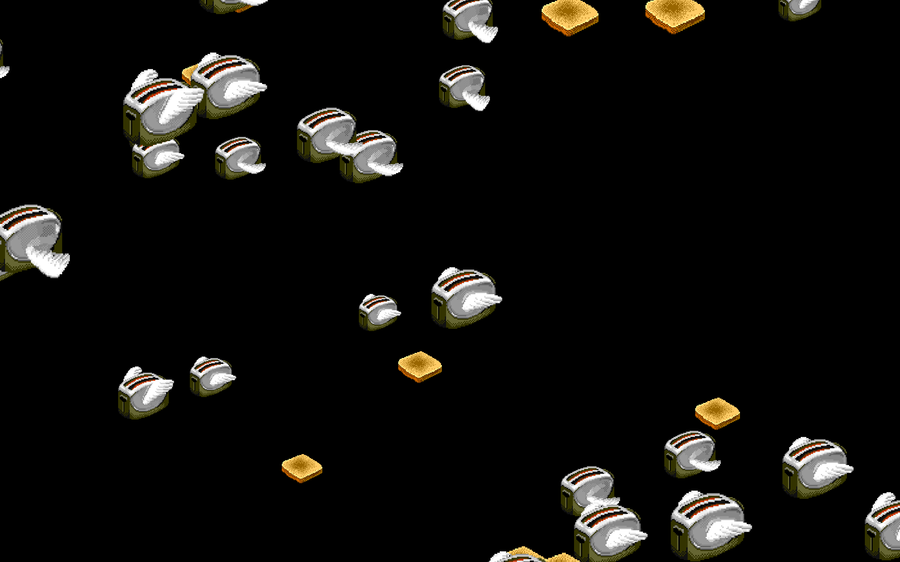

# Flying Toasters 🍞🛫

A faithful, Retina‑crisp recreation of Berkeley Systems' legendary **After Dark
"Flying Toasters"** screen saver — for modern macOS. Chrome toasters with flapping
wings glide from the top‑right to the bottom‑left across a black sky, trailed by
golden slices of toast, exactly as they did in 1989… only now drawn as clean vector
art so they stay sharp on Retina displays.



## What makes it faithful

Every behavior is matched to the original (see
[research/original-after-dark-notes.md](research/original-after-dark-notes.md) for
sources and the full breakdown):

- **Flight path** — everything flies on a 45° diagonal from the top‑right to the
  bottom‑left.
- **Parallax speed tiers** — toasters cross the field in roughly **10 / 16 / 24 s**;
  nearer ones are larger *and* faster, farther ones smaller and slower.
- **Four‑step wing flap** — the original's 4‑frame sprite flap (`steps(4)`, a ~0.4 s
  up → down → up cycle), with each toaster's phase and direction randomized so they
  beat out of sync. An optional smoother flap is available.
- **Toast** flies on the same speed tiers but does **not** flap, at the classic
  **~3 toasters : 1 toast** ratio.
- **Toast darkness** slider — the one real option the original module exposed.
- **Black sky.** (A faint retro starfield is available, off by default.)

It uses the **genuine original sprites** — the 256×64 four‑frame toaster sheet and the
64×64 toast — extracted from the classic *After Dark: Flying Toasters.saver* and
embedded as base64 in [src/Sprites.swift](src/Sprites.swift) so the build is fully
self‑contained. They're blitted with **nearest‑neighbor scaling**, so the original
pixel art stays crisp (never blurry) on Retina, and every toaster uses the same source
frames, so they all face the same way.


## Options

> **Heads-up:** the **Options… button in System Settings → Screen Saver is broken for
> third-party savers on modern macOS** (a `legacyScreenSaver` host bug, not this saver —
> the sheet opens fine elsewhere). So configure with the **Flying Toasters app** instead:
>
> ```bash
> ./build-app.sh && open "build/Flying Toasters.app"
> ```
>
> Its **Options…** button writes to the *same* preferences the installed screen saver
> reads, so your changes apply to the real saver the next time it starts. (You can still
> try the System Settings button — see the workaround below.)

| Option | What it does |
| --- | --- |
| **Number of toasters** | Flock density (1–60). |
| **Toast** | How much toast flies alongside (ratio to toasters). |
| **Speed** | Overall multiplier over the classic 10/16/24 s tiers. |
| **Toast darkness** | Tints the genuine toast from golden → burnt, faithful to the original slider. |
| **Faint starfield** | Optional stars behind the toasters (classic is plain black). |

**If you want the System Settings button to work:** quit System Settings, run
`killall legacyScreenSaver` in Terminal, reopen System Settings → Screen Saver, reselect
**Flying Toasters**, then try **Options…** again. It's hit-or-miss on current macOS —
the app above is the dependable route.

**From the command line**, you can also set anything directly:
```bash
defaults -currentHost write com.warpspeed.flyingtoasters toasterCount -int 40
defaults -currentHost write com.warpspeed.flyingtoasters speed -float 1.5
```

## Requirements

- macOS 11 or later (built and verified on Apple Silicon; `UNIVERSAL=1 ./build.sh`
  makes an arm64 + x86_64 binary).
- Xcode command‑line tools (for `swiftc`). No Xcode project needed.

## Quick start

```bash
# Build & open the standalone app (live player + the reliable Options panel):
./build-app.sh && open "build/Flying Toasters.app"

# Build the .saver bundle:
./build.sh              #  -> build/Flying Toasters.saver
UNIVERSAL=1 ./build.sh  #  universal arm64 + x86_64

# Install for the current user, then pick it in System Settings → Screen Saver:
./install.sh

# Remove it:
./uninstall.sh

# Quick dev run without bundling (raw executable):
./preview.sh
```

After installing, open **System Settings → Screen Saver** and choose **Flying
Toasters**. If it was already selected, switch to another saver and back to reload.

## How it works

```
src/
  ToasterArt.swift        Vector toaster (4 wing frames) + toast, drawn & cached as CGImages
  ToasterScene.swift      The simulation: spawn, parallax motion, flap timing, compositing
  ToasterSettings.swift   Plain settings value type (AppKit‑free, so it's testable)
  Defaults.swift          ScreenSaverDefaults persistence
  ConfigureSheet.swift    Programmatic Options sheet (no nib)
  FlyingToastersView.swift  ScreenSaverView principal class — ties it together
tools/
  render_sprites.swift    Headless sprite‑sheet PNG renderer (visual checks)
  render_scene.swift      Headless full‑frame PNG renderer (density/tuning)
  load_test.swift         Loads the built .saver exactly as macOS does and runs a frame
  preview_main.swift      The standalone app (live player + reliable Options panel)
  defaults_test.swift     Verifies settings persist to the shared preferences domain
research/                 Notes + the original reference sprites used while building
```

`ToasterArt` and `ToasterScene` are pure Core Graphics / Foundation, so the whole
thing can be rendered and validated **headlessly** — the images above were produced by
the `render_*` tools, and `load_test` confirms the bundle loads and renders through the
real `ScreenSaverView` path the OS uses.

## Credits & legal

*After Dark* and *Flying Toasters* were created by **Berkeley Systems**; the toaster and
toast pixel art is theirs. The sprites used here were extracted from the open
*After Dark: Flying Toasters.saver* by **Rasmus Andersson (rsms)**, whose WebView port
embedded **Bryan Braun's** *after‑dark‑css* artwork. This project is an independent,
non‑commercial homage that reuses that pixel art in a modern, native, Retina‑crisp
screen saver for Apple Silicon. *After Dark* and *Flying Toasters* are trademarks of
their respective owners; this project is not affiliated with or endorsed by them.

## License

The **source code** is MIT‑licensed (see [LICENSE](LICENSE)). The **sprite artwork**
(`src/Sprites.swift`, `assets/*.gif`) belongs to Berkeley Systems / the current *After
Dark* rights‑holders and is **not** covered by that license — it's bundled for a
non‑commercial, credited homage. If you fork this, please keep the attributions and
don't sell it.

Made for the love of a screen saver that didn't actually save any screens. 🚀
