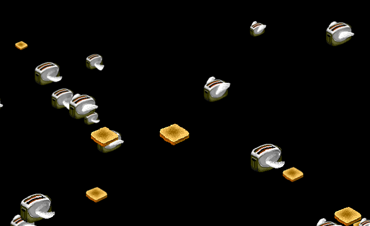
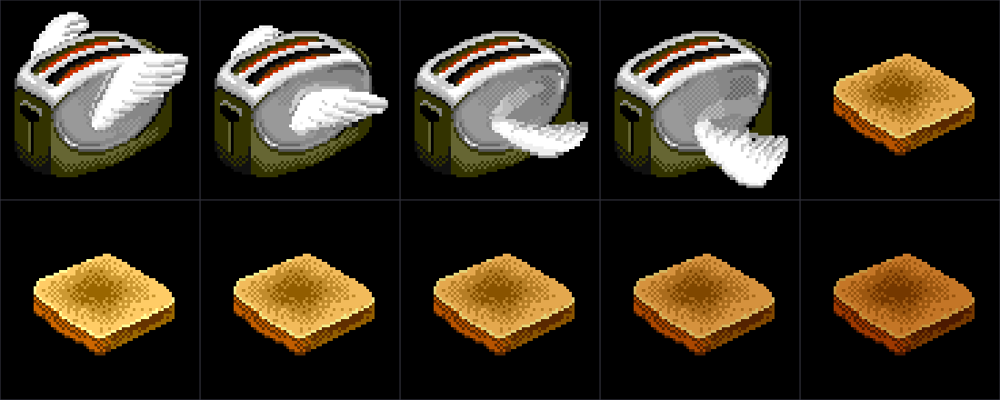

# Flying Toasters



Sometime around middle school, the Mac SE/30 in the corner of the classroom would nod
off, and a squadron of winged chrome toasters came flapping across that little 9‑inch
black‑and‑white screen, slices of toast tumbling along behind them. I'd lose whole study
halls just watching them drift by.

This is that screen saver, brought back for modern macOS — the genuine *After Dark*
toasters, running native and crisp on a Retina display. Same lazy diagonal glide, same
flapping wings, same golden toast.



## Download

Grab the latest build from the
**[Releases page](https://github.com/warpspeedtech/flying-toasters/releases/latest)** —
a universal `.saver` (Apple Silicon + Intel), no Xcode required.

1. Download **Flying-Toasters-1.0.saver.zip** and unzip it.
2. Clear the download quarantine (the saver is signed ad‑hoc, not notarized):
   ```bash
   xattr -dr com.apple.quarantine ~/Downloads/"Flying Toasters.saver"
   ```
3. Double‑click **Flying Toasters.saver** → click **Install**.
4. Choose **Flying Toasters** in **System Settings → Screen Saver**.

## Options

Click **Options…** in **System Settings → Screen Saver**:

| Option | What it does |
| --- | --- |
| **Number of toasters** | How many fill the sky (1–60). |
| **Toast** | How much toast flies alongside. |
| **Speed** | How fast they drift. |
| **Toast darkness** | Golden → burnt. |
| **Faint starfield** | Optional stars behind the toasters (off by default). |

There's also a small **Flying Toasters.app** (`./build-app.sh`) that runs the saver in a
window with the same Options, handy for tweaking with a live preview.

## Build from source

```bash
git clone https://github.com/warpspeedtech/flying-toasters
cd flying-toasters
./build.sh        # -> build/Flying Toasters.saver   (UNIVERSAL=1 for arm64 + x86_64)
./install.sh      # install for the current user
./uninstall.sh    # remove it
./preview.sh      # quick windowed run, no install
```

Requires macOS 11+ and the Xcode command‑line tools (`swiftc`) — no Xcode project.

## How it works

```
src/
  Sprites.swift           Genuine After Dark sprites, embedded as base64
  ToasterArt.swift        Slices the sprite sheet into wing frames; tints toast; caches CGImages
  ToasterScene.swift      The simulation: spawn, parallax motion, flap timing, compositing
  ToasterSettings.swift   Plain settings value type (AppKit-free, so it's testable)
  Defaults.swift          ScreenSaverDefaults persistence
  ConfigureSheet.swift    Programmatic Options sheet (no nib)
  FlyingToastersView.swift  ScreenSaverView principal class — ties it together
tools/
  preview_main.swift      Standalone app (live player + Options)
  render_scene.swift      Headless full-frame PNG renderer
  render_gif.swift        Seamlessly-looping demo GIF renderer
  render_sprites.swift    Headless sprite-sheet renderer
  load_test.swift         Loads the built .saver exactly as macOS does and runs a frame
  defaults_test.swift     Checks settings persist to the shared preferences domain
```

The toasters and toast use the genuine original sprites (the 256×64 four‑frame sheet and
the 64×64 toast), blitted with nearest‑neighbor scaling so the pixel art stays crisp on
Retina. `ToasterArt` and `ToasterScene` are pure Core Graphics, so frames can be rendered
headlessly — that's how the images here were made.

## Credits & license

*After Dark* and *Flying Toasters* were created by **Berkeley Systems**, and the toaster
and toast pixel art is theirs. The sprites were taken from the open
*After Dark: Flying Toasters.saver* by **Rasmus Andersson (rsms)**, whose WebView port
embedded **Bryan Braun's** *after‑dark‑css* artwork. This is an independent,
non‑commercial homage; *After Dark* and *Flying Toasters* are trademarks of their
respective owners, and this project is not affiliated with or endorsed by them.

The **source code** is MIT‑licensed (see [LICENSE](LICENSE)). The **sprite artwork**
(`src/Sprites.swift`, `assets/*.gif`) belongs to its rights‑holders and is **not**
covered by that license — it's bundled for a credited, non‑commercial homage. If you fork
this, please keep the attributions and don't sell it.
